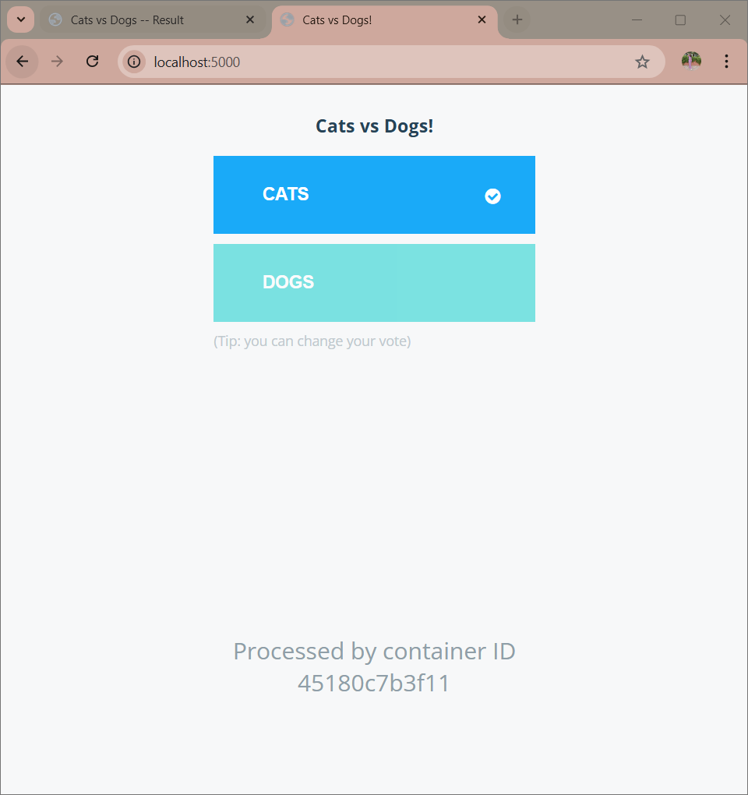
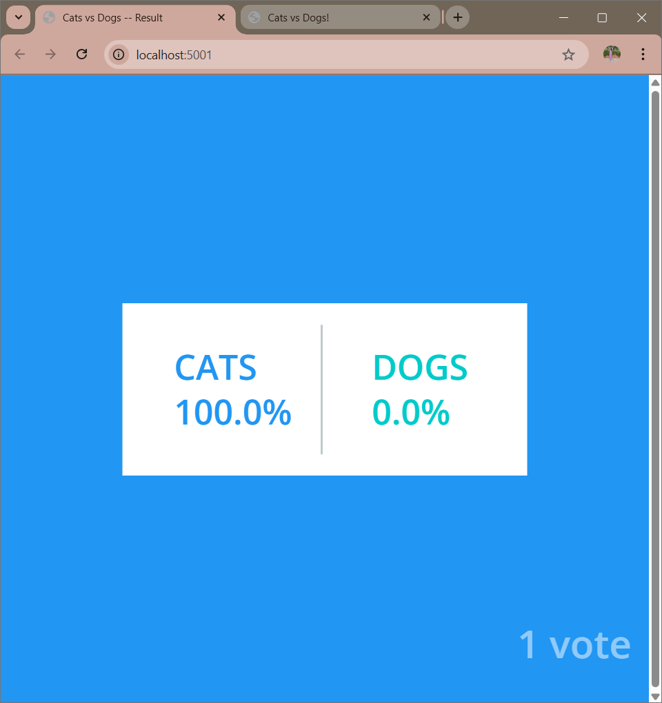

# 🗳️ Docker Voting App


---

## 📌 Project Overview

A **multi-container voting application** deployed using Docker Compose on AWS EC2.
This project demonstrates container orchestration, networking, and real-world cloud deployment.

---

## 🧩 Architecture

* 🟢 Voting App (Frontend)
* 🔴 Redis (In-memory DB)
* 🔵 Worker (Processes votes)
* 🟣 PostgreSQL (Database)
* 🟡 Result App (Displays results)

---

## 🛠️ Tech Stack

* Docker 🐳
* Docker Compose
* AWS EC2 ☁️
* Redis
* PostgreSQL

---

## 🌐 Live Demo

* Voting App 👉 http://44.193.198.33:5000
* Result App 👉 http://44.193.198.33:5001

---

## 📸 Screenshots

### 🟢 Voting Interface



### 🟡 Results Dashboard



---

## ▶️ Run Locally

```bash
docker compose up -d
```

---

## ☁️ Deployment Steps

1. Launch EC2 instance
2. Install Docker & Docker Compose
3. Upload project files
4. Run:

```bash
docker compose up -d
```

5. Configure security group (ports 5000, 5001)

---

## 💡 Key Learnings

* Multi-container architecture
* Container networking
* Cloud deployment using AWS
* Debugging Docker & Git issues

---

## 🚀 Future Improvements

* Add Nginx reverse proxy
* Enable HTTPS (SSL)
* CI/CD pipeline integration
* Kubernetes deployment

---

## 👩‍💻 Author

**Priyanshi Kothari**

* GitHub: https://github.com/priyanshikothari10
* LinkedIn: https://www.linkedin.com/in/priyanshi-kothari-93975932a/

---

⭐ If you like this project, give it a star!
